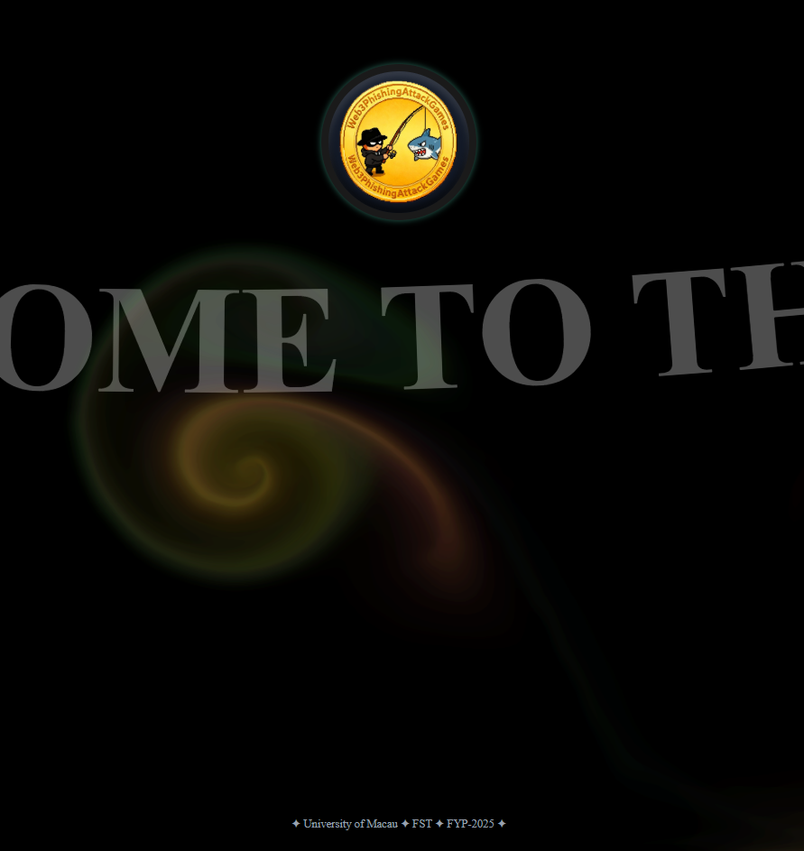
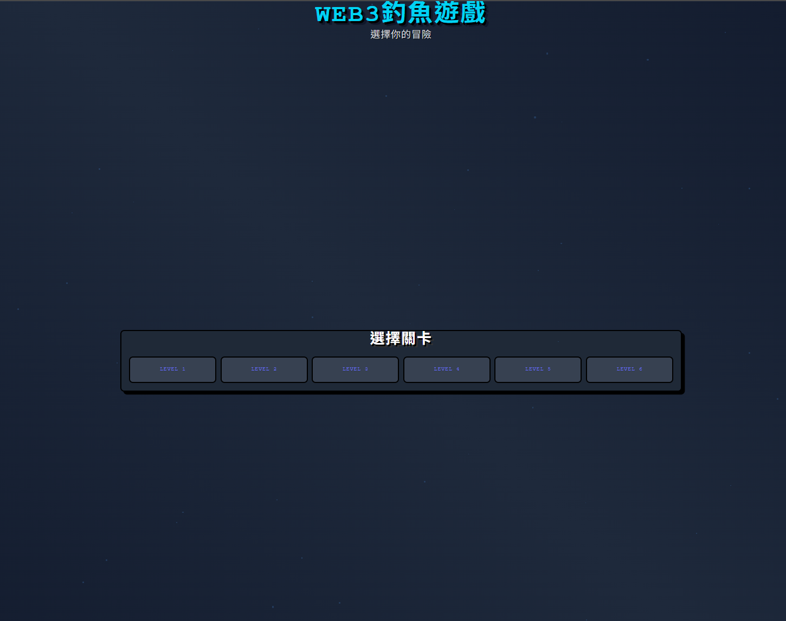

# October summary

### Deliver the front-end design

### Next Action
Professor Wang Ye recommended that the training platform should included entire web3 investing process from newbie to  veteran, so we need to redesigned all the phishing attacks to make it like a simulator. Hence, the next we will do is literature interview, design the missions on the platform, and experienced in the investing process.